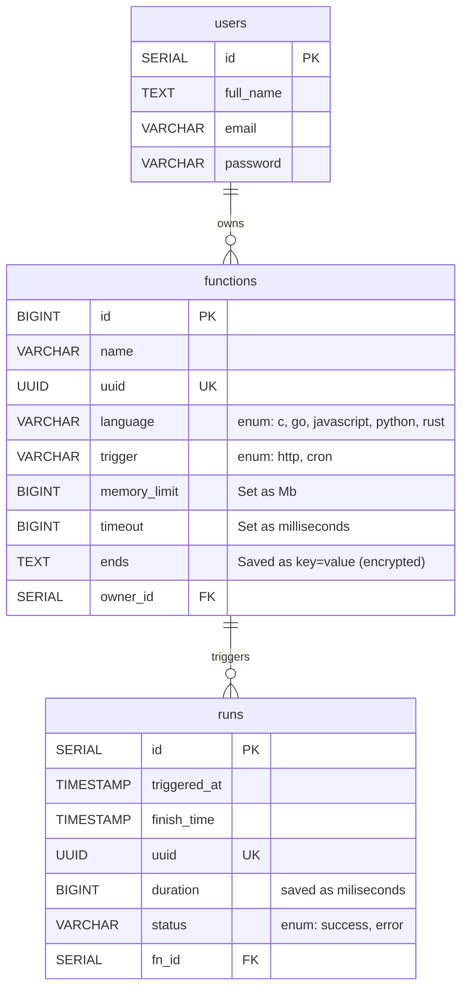

# FAASM: WASM-based FaaS runner

## Tools
- seaorm cli
- cargo
- npm/npx

## DB Schema

```mermaid
erDiagram
    users ||--o{ functions : "owns"
    functions ||--o{ runs : "triggers"

    users {
        SERIAL id PK
        TEXT full_name
        VARCHAR email
        VARCHAR password
    }

    functions {
        BIGINT id PK
        VARCHAR name
        UUID uuid UK
        VARCHAR language "enum: c, go, javascript, python, rust"
        VARCHAR trigger "enum: http, cron"
        BIGINT memory_limit "Set as Mb"
        BIGINT timeout "Set as milliseconds"
        TEXT ends "Saved as key=value (encrypted)"
        SERIAL owner_id FK
    }

    runs {
        SERIAL id PK
        TIMESTAMP triggered_at
        TIMESTAMP finish_time
        UUID uuid UK
        BIGINT duration "saved as miliseconds"
        VARCHAR status "enum: success, error"
        SERIAL fn_id FK
    }
```
